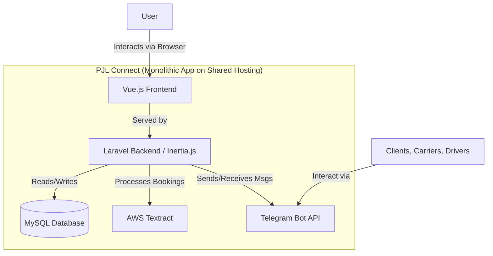
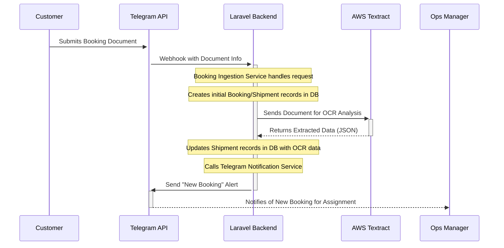

## **PJL Connect Fullstack Architecture Document**

##Introduction

This document outlines the complete fullstack architecture for **PJL Connect**, including backend systems, frontend implementation, and their integration. It serves as the single source of truth for AI-driven development, ensuring consistency across the entire technology stack.

### **Starter Template or Existing Project**

To accelerate development and ensure best practices, we will use the official **Laravel Breeze** starter kit with the **Vue and Inertia.js** stack. This provides a minimal and elegant starting point, scaffolding the authentication system and configuring the frontend build process.

-----

## \#\# High Level Architecture

### **Technical Summary**

**PJL Connect** will be a **monolithic Laravel** application built within a **monorepo**. It will serve a modern, single-page application-style frontend built with **Vue.js**, using **Inertia.js** to seamlessly connect the two. The system will be deployed on the specified shared hosting environment and will integrate heavily with external services, primarily the **Telegram Bot API** and **AWS Textract**.

### **Platform and Infrastructure Choice**

  * **Platform**: The application will be deployed on the existing **shared hosting** environment.
  * **Key Services**: The platform must support **PHP** (latest stable version), **MySQL**, and a web server (**Apache** or **Nginx**).

### **Repository Structure**

  * **Structure**: **Monorepo**. A single repository is the most effective structure for managing this monolithic application.

### **High Level Architecture Diagram**



-----

## \#\# Tech Stack

| Category | Technology | Version (Latest Stable) | Rationale |
| :--- | :--- | :--- | :--- |
| **Frontend Language** | TypeScript | 5.x | Provides type safety and better developer tooling for Vue.js. |
| **Frontend Framework**| Vue.js | 3.x | A powerful and approachable framework with excellent integration with Laravel. |
| **UI Component Library**| Tailwind CSS | 3.x | A utility-first CSS framework for rapid, custom UI development. |
| **State Management** | Pinia | 2.x | The official, lightweight state management library for Vue.js. |
| **Backend Language** | PHP | 8.3+ | The required language for the Laravel framework. |
| **Backend Framework**| Laravel | 11.x | Robust, scalable, and with a rich ecosystem. |
| **API Style** | Inertia.js | 1.x | Connects the Laravel backend to the Vue.js frontend seamlessly. |
| **Database** | MySQL | 8.x | Your specified relational database. |
| **Authentication** | Laravel Breeze | 2.x | Provides scaffolding for login/registration, which we will adapt for Telegram. |
| **Testing (Backend)** | Pest / PHPUnit | Latest | The standard, powerful testing frameworks for Laravel. |
| **Testing (Frontend)**| Vitest | 1.x | A modern, fast testing framework for Vue.js applications. |
| **Build Tool** | Vite | 5.x | The high-performance build tool configured by default with Laravel. |
| **Deployment** | Manual (FTP/SSH) | N/A | To align with the constraint of using existing shared hosting. |

-----

## \#\# Data Models

### **New Model: Company**

  * **Purpose**: To act as a central "address book" for any company involved in a transaction (customer, shipper, consignee).

### **New Top-Level Model: Booking**

  * **Purpose**: Represents the initial, complete request from a customer. This is the parent record for all related activities.

### **Updated Model: Shipment**

  * **Purpose**: Represents a single, discrete consignment handled by one carrier to fulfill all or part of a customer Booking.

### **Updated Model: ShipmentDetail**

  * **Purpose**: Stores the specific details of a single container or package within a single Shipment.

-----

## \#\# Database Schema

```sql
-- Central "address book" for all companies
CREATE TABLE companies (
    id BINARY(16) PRIMARY KEY,
    company_name VARCHAR(255) NOT NULL,
    address TEXT,
    contact_person VARCHAR(255),
    phone_number VARCHAR(50),
    email VARCHAR(255),
    created_at TIMESTAMP DEFAULT CURRENT_TIMESTAMP,
    updated_at TIMESTAMP DEFAULT CURRENT_TIMESTAMP ON UPDATE CURRENT_TIMESTAMP
);

-- Logistics partners/carriers
CREATE TABLE carriers (
    id BINARY(16) PRIMARY KEY,
    company_name VARCHAR(255) NOT NULL,
    created_at TIMESTAMP DEFAULT CURRENT_TIMESTAMP,
    updated_at TIMESTAMP DEFAULT CURRENT_TIMESTAMP ON UPDATE CURRENT_TIMESTAMP
);

-- Top-level customer request
CREATE TABLE bookings (
    id BINARY(16) PRIMARY KEY,
    booking_reference VARCHAR(255) NOT NULL UNIQUE,
    company_id BINARY(16) NOT NULL,
    status VARCHAR(50) NOT NULL,
    booking_date DATETIME NOT NULL,
    FOREIGN KEY (company_id) REFERENCES companies(id)
);

-- A single consignment handled by one carrier
CREATE TABLE shipments (
    id BINARY(16) PRIMARY KEY,
    booking_id BINARY(16) NOT NULL,
    carrier_id BINARY(16),
    shipper_company_id BINARY(16),
    consignee_company_id BINARY(16),
    transport_mode ENUM('Sea', 'Air', 'Land') NOT NULL,
    mbl_number VARCHAR(255),
    hbl_number VARCHAR(255),
    mawb_number VARCHAR(255),
    hawb_number VARCHAR(255),
    vessel_name VARCHAR(255),
    voyage_number VARCHAR(255),
    flight_number VARCHAR(255),
    FOREIGN KEY (booking_id) REFERENCES bookings(id),
    FOREIGN KEY (carrier_id) REFERENCES carriers(id),
    FOREIGN KEY (shipper_company_id) REFERENCES companies(id),
    FOREIGN KEY (consignee_company_id) REFERENCES companies(id)
);

-- Specific items/containers within a shipment
CREATE TABLE shipment_details (
    id BINARY(16) PRIMARY KEY,
    shipment_id BINARY(16) NOT NULL,
    description TEXT,
    container_number VARCHAR(255),
    quantity INT,
    net_weight_kg DECIMAL(10, 2),
    gross_weight_kg DECIMAL(10, 2),
    cbm DECIMAL(10, 3),
    FOREIGN KEY (shipment_id) REFERENCES shipments(id) ON DELETE CASCADE
);
```

-----

## \#\# API Specification

Since we've chosen **Inertia.js**, we won't have a traditional, separate REST or GraphQL API. Inertia allows our Laravel backend to serve data and page components directly to our Vue.js frontend in a tightly-coupled way.

-----

## \#\# Components

### **Backend Components (Laravel Services)**

  * **Authentication Service**: Handles the Telegram login workflow and manages user roles.
  * **Booking Ingestion Service**: Manages receiving bookings, interfacing with the OCR service, and creating records.
  * **Shipment Workflow Service**: Contains the core business logic for status transitions and carrier assignment.
  * **Telegram Notification Service**: A centralized service for dispatching all outgoing bot messages.
  * **Analytics Service**: Handles data aggregation and CSV exports.
  * **Document Generation Service**: Generates customs documents from PDF/Excel templates.

### **Frontend Components (Vue.js Views/Pages)**

  * **Dashboard/Queue View**: The primary "ticket-style" interface for the Ops team.
  * **Shipment Detail View**: The detailed page for a single shipment.
  * **Admin Pages (CRUD)**: Pages for managers to manage Companies, Carriers, and Services.
  * **Stats Dashboard View**: The simple page for displaying key KPIs for managers.

-----

## \#\# External APIs

### **Telegram Bot API**

  * **Purpose**: To handle all real-time communication and user authentication.
  * **Documentation**: `https://core.telegram.org/bots/api`

### **Optical Character Recognition (OCR) Service**

  * **Purpose**: To extract structured text and form data from booking documents.
  * **Provider**: **Amazon Web Services (AWS) Textract**.
  * **PHP Library**: **AWS SDK for PHP** (`aws/aws-sdk-php`).

-----

## \#\# Core Workflows

This section uses a sequence diagram to illustrate the "New Booking Ingestion" process, showing how major components and external APIs interact.



-----

## \#\# Frontend Architecture

This architecture is based on our decision to use **Laravel Breeze** with **Inertia.js**, which creates a modern, tightly-integrated full-stack application.

### **Component Architecture**

  * All frontend components will reside in the `resources/js/` directory, with subdirectories for `Components`, `Layouts`, and `Pages`. Components will use Vue 3's `<script setup>` syntax.

### **State Management Architecture**

  * We will use **Pinia**, the official state management library for Vue.js, for any application-wide state (e.g., the authenticated user).

### **Routing Architecture**

  * All routing is handled server-side by **Laravel** in the `routes/web.php` file. The frontend `resources/js/Pages/` directory directly maps to our server-side routes. Route protection is handled by Laravel's `auth` middleware.

-----

## \#\# Backend Architecture

This architecture follows standard, best-practice patterns for the Laravel framework.

### **Service Architecture (Traditional Server)**

  * Routes will be defined in `routes/web.php`. Controllers will be located in `app/Http/Controllers/`. A typical controller method will fetch data and render a Vue page component via Inertia.

### **Database Architecture**

  * The complete MySQL database schema has already been defined in the **"Database Schema"** section. We will use Laravel's built-in **Eloquent ORM** for all standard database interactions.

### **Authentication and Authorization**

  * The login process will follow the standard Telegram Login Widget flow. Route protection will be handled by Laravel's standard `auth` middleware, with a custom "Manager" middleware for admin-only sections.

-----

## \#\# Unified Project Structure

This structure is the standard, proven layout for a Laravel project using Inertia.js and Vue.js.

```
pjl-connect/
├── app/
│   ├── Http/
│   │   └── Controllers/
│   ├── Models/
│   └── Services/
├── database/
│   └── migrations/
├── resources/
│   ├── js/
│   │   ├── Components/
│   │   ├── Layouts/
│   │   └── Pages/
├── routes/
│   └── web.php
├── tests/
├── package.json
├── composer.json
└── vite.config.js
```

-----

## \#\# Development Workflow

### **Local Development Setup**

Developers will need PHP, Composer, Node.js, and MySQL. Setup involves cloning the repo, running `composer install` and `npm install`, configuring the `.env` file, and running `php artisan migrate`.

### **Running the Development Servers**

Two commands must be run in separate terminals:

1.  `npm run dev` (Starts the Vite server for frontend assets)
2.  `php artisan serve` (Starts the Laravel backend server)

-----

## \#\# Deployment Architecture

### **Deployment Strategy**

The process will be a manual deployment to the shared hosting environment via SFTP/SSH. Frontend assets will be compiled with `npm run build` before upload.

### **CI/CD Pipeline**

A fully automated pipeline is out of scope for the MVP. However, **GitHub Actions** will be used to automatically run tests and build assets on every push to ensure code quality before manual deployment.

-----

## \#\# Security and Performance

### **Security Requirements**

We will leverage Laravel's built-in features for security, including:

  * Eloquent ORM to prevent SQL injection.
  * Form Request validation for all incoming data.
  * Built-in CSRF and XSS protection.
  * Middleware for route protection and authorization.

### **Performance Optimization**

  * **Backend**: Use eager loading to prevent N+1 query problems and leverage Laravel's caching system.
  * **Frontend**: Vite will handle asset bundling, minification, and code-splitting automatically.

-----

## \#\# Testing Strategy

### **Testing Pyramid**

Our strategy will focus on a large base of fast **Unit Tests**, a smaller layer of **Integration/Feature Tests**, and minimal **End-to-End Tests** for the MVP.

### **Test Organization**

  * **Backend (Pest/PHPUnit)**: Tests will be organized in Laravel's default `tests/Unit` and `tests/Feature` directories.
  * **Frontend (Vitest)**: Tests will reside within the `resources/js/` directory.

-----

## \#\# Coding Standards

### **Critical Fullstack Rules**

  * Always use Inertia responses from Laravel controllers to render pages.
  * Place all complex business logic inside Service classes.
  * Use Repositories for complex database queries.
  * Access environment variables only through Laravel's `config()` helper.

-----

## \#\# Error Handling Strategy

We will use the built-in capabilities of Laravel and Inertia.js. Backend validation errors will be automatically sent back to the Vue frontend and displayed next to the relevant form fields using Inertia's form helper. Unhandled exceptions will be caught by Laravel's global exception handler.

-----

## \#\# Monitoring and Observability

For the MVP, we will use a pragmatic and low-cost stack:

  * **Error Tracking**: **Sentry.io** for both frontend and backend real-time error alerts.
  * **Backend Monitoring**: Laravel's built-in file-based logging.
  * **Uptime Monitoring**: An external service like **UptimeRobot**.

-----