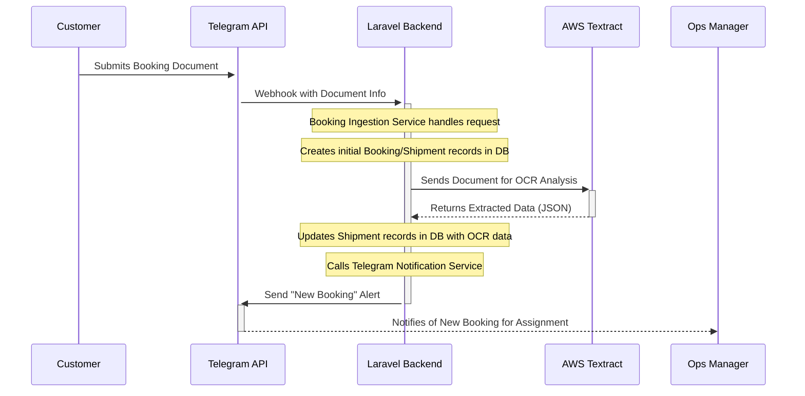

# \#\# Core Workflows

This section uses a sequence diagram to illustrate the "New Booking Ingestion" process, showing how major components and external APIs interact.

```mermaid
sequenceDiagram
    participant Customer
    participant Telegram API
    participant Laravel Backend
    participant AWS Textract
    participant Ops Manager

    Customer->>+Telegram API: Submits Booking Document
    Telegram API->>+Laravel Backend: Webhook with Document Info
    
    activate Laravel Backend
    Note over Laravel Backend: Booking Ingestion Service handles request
    Note over Laravel Backend: Creates initial Booking/Shipment records in DB
    Laravel Backend->>+AWS Textract: Sends Document for OCR Analysis
    AWS Textract-->>-Laravel Backend: Returns Extracted Data (JSON)
    Note over Laravel Backend: Updates Shipment records in DB with OCR data
    
    Note over Laravel Backend: Calls Telegram Notification Service
    Laravel Backend->>+Telegram API: Send "New Booking" Alert
    deactivate Laravel Backend

    Telegram API-->>-Ops Manager: Notifies of New Booking for Assignment
```

-----

