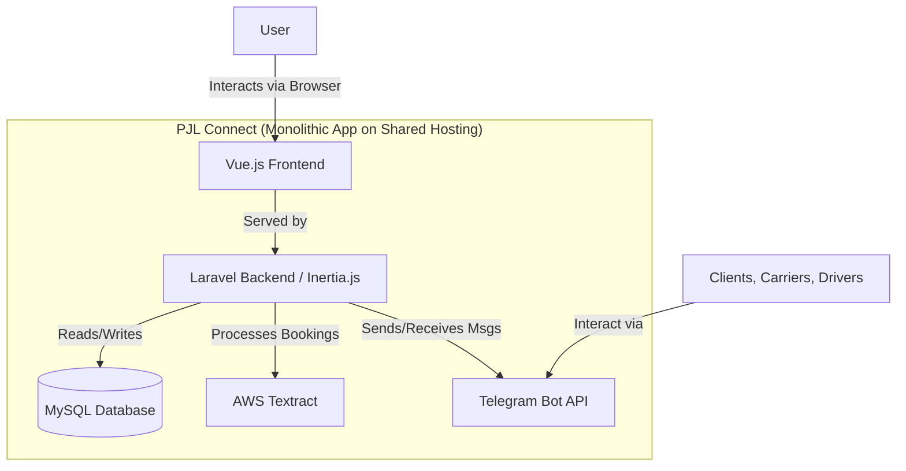

# \#\# High Level Architecture

### **Technical Summary**

**PJL Connect** will be a **monolithic Laravel** application built within a **monorepo**. It will serve a modern, single-page application-style frontend built with **Vue.js**, using **Inertia.js** to seamlessly connect the two. The system will be deployed on the specified shared hosting environment and will integrate heavily with external services, primarily the **Telegram Bot API** and **AWS Textract**.

### **Platform and Infrastructure Choice**

  * **Platform**: The application will be deployed on the existing **shared hosting** environment.
  * **Key Services**: The platform must support **PHP** (latest stable version), **MySQL**, and a web server (**Apache** or **Nginx**).

### **Repository Structure**

  * **Structure**: **Monorepo**. A single repository is the most effective structure for managing this monolithic application.

### **High Level Architecture Diagram**

-----

