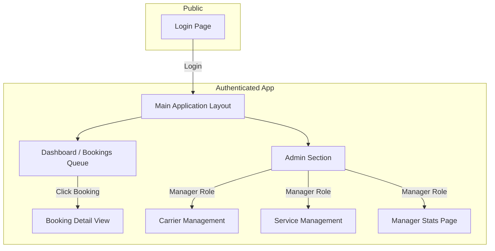

## **PJL Connect UI/UX Specification**

## Introduction

This document defines the user experience goals, information architecture, user flows, and visual design specifications for **PJL** **Connect's** user interface. It serves as the foundation for visual design and frontend development, ensuring a cohesive and user-centered experience.

### **Overall** **UX** **Goals** & **Principles**

  * **Target** **User** **Personas**:
      * **Primary**: The **PJL** **Logistics** **Ops** **Team** & **Managers**, who need an efficient, task-oriented system.
      * **Secondary**: Clients, Carrier Staff, and Drivers, who need simple, clear, and fast mobile-first interactions via **Telegram**.
  * **Usability** **Goals**:
      * **Efficiency**: Drastically reduce the time and clicks required for the **Ops** team to process a booking.
      * **Clarity**: Provide a clear, at-a-glance status for any shipment at any time.
      * **Ease** of **Use**: Ensure all users, especially external partners, can interact with the system with zero training.
  * **Design** **Principles**:
    1.  **Task-Oriented**: The UI should always guide the user to the next logical action.
    2.  **Clarity** **Above** **All**: Prioritize clear information and unambiguous actions over aesthetic complexity.
    3.  **Seamless** **Handoffs**: The transition from a **Telegram** alert to the web **Back** **Office** should be smooth and context-aware.

## Information Architecture (IA)

This section outlines the structure of the **PJL** **Connect** **Back** **Office**, ensuring that users can find information and accomplish tasks logically and intuitively.

### **Site** **Map** / **Screen** **Inventory**



### **Navigation** **Structure**

  * **Primary** **Navigation**: Simple and role-based. "Dashboard" for all users; "Admin" is added for Managers.
  * **Secondary** **Navigation**: Within the "Admin" section, links for "Carrier Management", "Service Management", and "Manager Stats".
  * **Breadcrumb** **Strategy**: Will be used on detailed pages for clear context and easy navigation (e.g., `Admin > Carrier Management > Edit Carrier`).

## User Flows

### **New** **Booking** **Processing** & **Dispatch**

  * **User** **Goal**: For an **Ops** **Team** **Member** to efficiently process a new, automatically ingested booking and successfully dispatch it to a carrier.
  * **Entry** **Point**: A new booking appears on the Dashboard/Queue with the status "Pending Ops Review".
  * **Success** **Criteria**: The booking is accepted by a carrier, and its status is updated to "Awaiting Carrier Info".

#### Flow Diagram

```mermaid
graph TD
    A[Start: New Booking in Queue<br/>Status: Pending Ops Review] --> B{Is OCR data correct?};
    B -- No --> C[Ops Manually Corrects Data];
    B -- Yes --> D[Ops Selects a Carrier];
    C --> D;
    D --> E[Ops Clicks "Dispatch"];
    E --> F{Carrier Responds via Bot};
    F -- Accepts --> G[Success: Booking Accepted<br/>Status: Awaiting Carrier Info];
    F -- Declines --> H[Ops Alerted: Re-assign Carrier];
    F -- No Response --> I[System Sends 15-min Reminders];
    H --> D;
    I --> F;
```

## Wireframes & Mockups

### **Primary** **Design** **Files**

High-fidelity visual designs and prototypes will be developed in a collaborative tool like **Figma**. The final design file will be linked here as the single source of truth for the UI's visual appearance.

### **Key** **Screen** **Layouts**

A low-fidelity wireframe for the **Booking** **Detail** **View**:

```
+--------------------------------------------------------------------------+
| ## Booking ID: PJL-1024  |  Status: [In Transit]  | P&L: [$150.00]    | Header
+--------------------------------------------------------------------------+
| Left Column (70%)                  | Right Column (30%)                 | Main
|------------------------------------|------------------------------------|
| ### Shipment Details              | ### Carrier & Driver Info         |
| - Pickup: [Address]                | - Carrier: [Carrier Name]          |
| - Destination: [Address]           | - Truck: [Plate #], [Size]         |
| - Customer: [Name], [Contact]      | - Driver: [Name], [Telegram]       |
|                                    |                                    |
| ### Attached Documents            | ### Live Map View                 |
| - [Booking_Order.pdf] (view)       | [Embedded map showing live         |
| - [Carrier_DO.pdf] (view)          |  driver location]                  |
|                                    |                                    |
| ### Communication Log             | ### Action Panel                  |
| - [Timestamp] Msg to Carrier       | [  Update Customer Button  ]        |
| - [Timestamp] Carrier Accepted     | [ Generate Customs Doc Button ]    |
| - [Timestamp] Msg to Customer      |                                    |
+--------------------------------------------------------------------------+
```

  * **Interaction** **Notes**: The **Action** **Panel** is dynamic and only shows buttons relevant to the booking's current status.

## Component Library / Design System

### **Design** **System** **Approach**

For the **MVP**, we will create a focused, internal component library to ensure visual and functional consistency.

### **Core** **Components**

  * **Button**: With Primary, Secondary, and Danger variants.
  * **Input** **Field**: For all forms.
  * **Status** **Tag**: Colored tags to display booking status.
  * **Booking** **Card**: A container for summary info on the dashboard.
  * **Modal** (**Popup** **Dialog**): For confirmations and alerts.
  * **Data** **Table**: For lists in the Admin sections.

## Branding & Style Guide

### **Visual** **Identity**

The visual identity is defined by the official **PJL** **Logistics** logos.

### **Color** **Palette**

| Color Type | Hex Code (Estimated) | Usage |
| :--- | :--- | :--- |
| Primary | \#0D76A8 | The main dark blue from the "PJL" text. |
| Accent | \#33B5E5 | The vibrant light blue from the swoosh/outline. |
| Success | \#36B37E | Positive feedback, confirmations |
| Warning | \#FFAB00 | Cautions, important notices |
| Error | \#DE350B | Error messages, destructive actions |

### **Typography**

  * **Logotype**: The custom font in the logo is for branding use only.
  * **UI** **Font** **Family**: **Inter**, a clean sans-serif font for all interface text.

## Accessibility Requirements

  * **Standard**: The application will adhere to **Web Content Accessibility Guidelines (WCAG) 2.1 Level AA**.
  * **Key** **Features**: All functionality will be keyboard-navigable, all text will meet color contrast ratios, and the application will be built with semantic HTML for screen reader compatibility.

## Responsiveness Strategy

  * **Priority**: The primary experience is for desktop, but the design will be responsive and functional on tablets.
  * **Patterns**: Multi-column layouts will stack vertically on smaller screens, and navigation will collapse into a "hamburger" menu.

## Animation & Micro-interactions

  * **Principles**: Motion will be purposeful, swift, and accessible.
  * **Usage**: Subtle animations will be used for state transitions (hover/click feedback), loading indicators, and notifications to make the UI feel more responsive.

## Performance Considerations

  * **Goals**: Key pages will load in under 2.5 seconds, and all UI interactions will provide feedback in under 100 milliseconds.
  * **Strategies**: We will use code splitting, lazy loading of assets, and skeleton loaders to improve perceived performance.

## Next Steps

  * **Immediate** **Actions**:
    1.  Final approval of this **UI/UX** **Specification**.
    2.  Begin high-fidelity mockups in a design tool like **Figma**.
    3.  Engage the **Architect** to create the detailed `front-end-architecture.md`.

