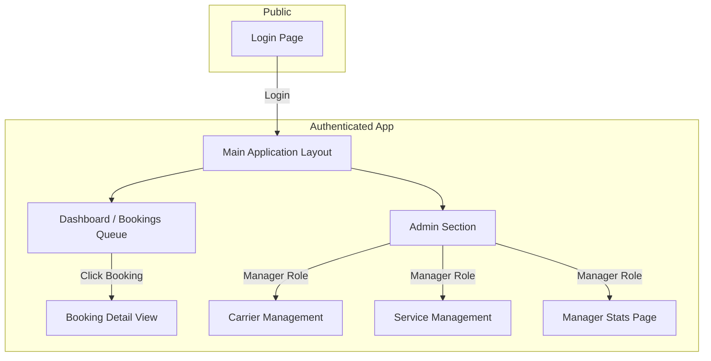

# Information Architecture (IA)

This section outlines the structure of the **PJL** **Connect** **Back** **Office**, ensuring that users can find information and accomplish tasks logically and intuitively.

### **Site** **Map** / **Screen** **Inventory**

### **Navigation** **Structure**

  * **Primary** **Navigation**: Simple and role-based. "Dashboard" for all users; "Admin" is added for Managers.
  * **Secondary** **Navigation**: Within the "Admin" section, links for "Carrier Management", "Service Management", and "Manager Stats".
  * **Breadcrumb** **Strategy**: Will be used on detailed pages for clear context and easy navigation (e.g., `Admin > Carrier Management > Edit Carrier`).

